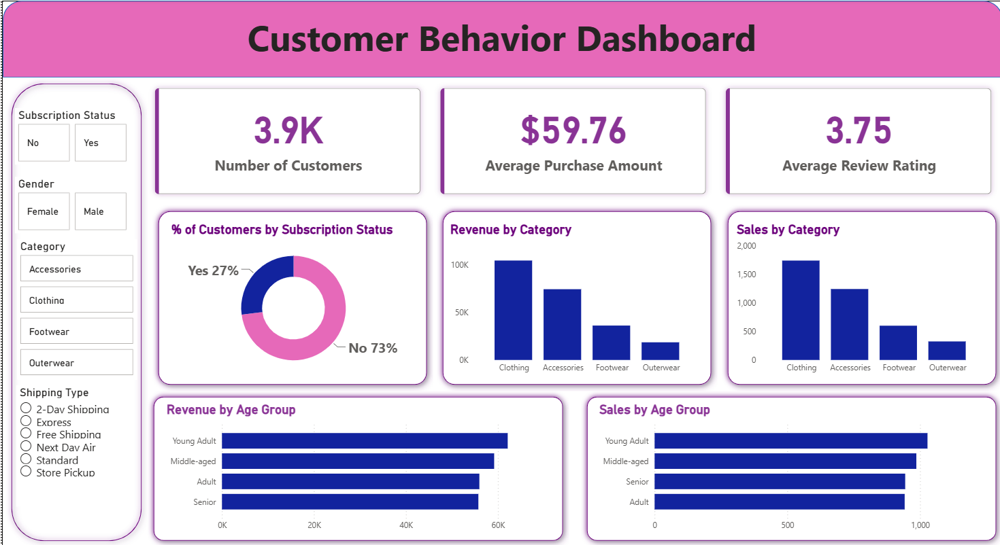

# Customer Segmentation & Value Analysis

End-to-end data analytics project analyzing customer segmentation and revenue drivers using Python, SQL, and Power BI. Includes EDA, customer value analysis, an interactive dashboard, and business insights.

## 📌 Project Overview

This project analyzes customer segmentation and revenue drivers to understand what factors contribute to high customer value. Using Python, SQL, and Power BI, the analysis identifies spending patterns, subscription impact, customer loyalty, and key business insights through an end-to-end analytics workflow.

The goal is to simulate a real-world data analyst project, from data exploration to a decision-ready dashboard.

## 🎯 Business Objectives

- Identify high-value customer segments
- Analyze the impact of subscriptions on revenue
- Understand customer behavior across age groups and product categories
- Provide actionable insights to improve revenue and customer retention

## 🧰 Tools & Technologies Used

- **Python** (Pandas, Matplotlib) – Data cleaning, feature engineering, EDA
- **SQL** (PostgreSQL) – Business queries and aggregations
- **Power BI** – Interactive dashboard and data visualization
- **GitHub** – Version control and project documentation

## 🧹 Data Preparation & Feature Engineering (Python)

- Cleaned and standardized column names
- Created new features:
  - Customer Segment (New, Returning, Loyal)
  - Age Groups (Young Adult, Adult, Middle-aged, Senior)
  - Estimated Customer Lifetime Value (CLV)
- Performed exploratory data analysis (EDA) to uncover trends and patterns

## 🗄️ SQL Analysis

Key business questions answered using PostgreSQL:

- Revenue contribution by gender and age group
- Subscription vs non-subscription revenue comparison
- Customer segmentation based on purchase history
- Discount impact on average order value and revenue
- Identification of high-value customers (CLV-focused analysis)

## 📊 Power BI Dashboard

The dashboard presents insights through:

- **KPI cards** – 3.9K total customers, $59.76 average purchase amount, 3.75 average review rating
- **Subscription breakdown** – 73% of customers are non-subscribers vs. 27% subscribers
- **Revenue & Sales by Category** – Clothing leads, followed by Accessories, Footwear, and Outerwear
- **Revenue & Sales by Age Group** – Young Adult and Middle-aged segments drive the highest revenue
- **Interactive filters** – Subscription status, gender, category, and shipping type for dynamic exploration

## 💡 Key Insights

- Non-subscribers make up the majority (73%) of the customer base, indicating a significant opportunity for subscription conversion
- **Clothing** is the top-performing category by both revenue and sales volume
- **Young Adult** and **Middle-aged** customers contribute the most to revenue, while Senior and Adult segments lag behind
- Average review rating of **3.75** suggests room to improve customer satisfaction
- Average purchase amount of **$59.76** provides a benchmark for evaluating discount and upsell strategies

## 📈 Business Recommendations

- Launch targeted subscription campaigns to convert the 73% non-subscriber base
- Double down on Clothing inventory and marketing given its category dominance
- Design campaigns specifically for Young Adult and Middle-aged segments to maximize ROI
- Investigate drivers behind the 3.75 review rating to identify quick wins for customer satisfaction
- Use average purchase amount as a baseline to test pricing and bundling strategies

## 🔚 Conclusion

This project demonstrates a complete data analytics pipeline, combining technical skills with business thinking. It showcases the ability to transform raw data into meaningful insights and a decision-support dashboard, aligned with real-world data analyst responsibilities.

## 📄 License

This project is licensed under the MIT License.
